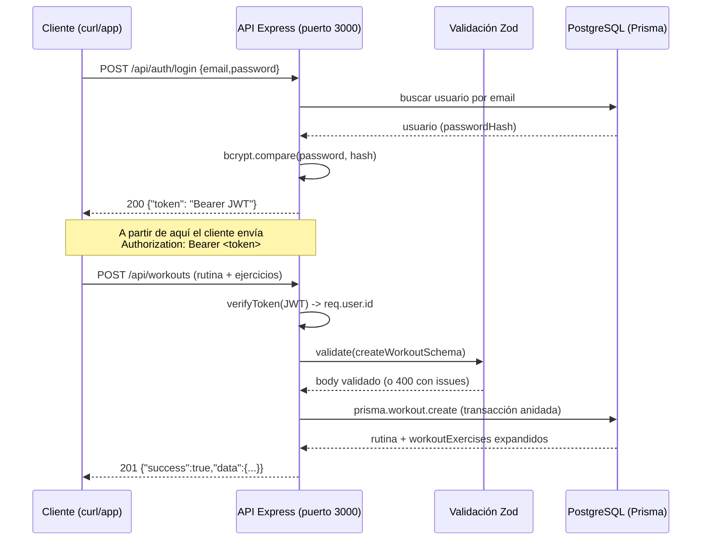
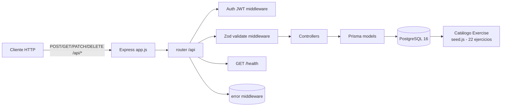

# Workout Tracker — API REST

API REST para la gestión de entrenamientos: usuarios con autenticación JWT, rutinas de entrenamiento con ejercicios anidados, agenda (`scheduledAt`) y reportes de progreso (volumen tonelado, series, repeticiones y desglose por grupo muscular).

Backend construido con **Node.js 20 + Express 4 + Prisma ORM + Zod + JWT**, sobre **PostgreSQL 16**. Documentación OpenAPI disponible en `backend/docs/openapi.json`.

   

## Índice

1. [Descripción](#descripcion)
2. [Funcionamiento](#funcionamiento)
3. [Estructura del proyecto](#estructura-del-proyecto)
4. [Requisitos de instalación](#requisitos-de-instalacion)
5. [Instalación](#instalacion)
6. [Dominio de datos](#dominio-de-datos)
7. [Referencia de endpoints](#referencia-de-endpoints)
8. [Ejemplos de uso](#ejemplos-de-uso)
9. [Tests](#tests)
10. [Licencia y contribución](#licencia-y-contribucion)

## Descripción

El sistema permite:

- **Registrar y autenticar usuarios** (`/auth/signup`, `/auth/login`) emitiendo JWT Bearer.
- **Gestionar rutinas de entrenamiento** (`/workouts`) con hasta 30 ejercicios por rutina, cada uno con series, repeticiones y peso.
- **Programar rutinas** en una fecha/hora concreta (`/workouts/:id/schedule`).
- **Marcar estados**: `planned`, `completed` (autogenera `completedAt`) o `cancelled` (limpia `completedAt`).
- **Obtener reportes de progreso** (`/reports/progress`): volumen total en kg, series, repeticiones, promedio por sesión, desglose por grupo muscular y últimas sesiones completadas.

Cada usuario solo ve y modifica sus propias rutinas (toda operación pasa por el `userId` del token). El catálogo de ejercicios se siembra con un script (22 ejercicios de fuerza, cardio y movilidad).

## Funcionamiento

Flujo de una petición protegida:



Capa de error: rutas no registradas devuelven `404` con el envoltorio `{success:false, error}`, la validación de entradas (`validate.middleware.js`) devuelve `400` con `issues[{path,message}]`, y el manejador central (`error.middleware.js`) traduce errores Prisma (`P2002`→409, `P2025`→404, `P2003`→400).

**Limitaciones conocidas**

- No hay endpoint público para listar/crear el catálogo de ejercicios: la creación de rutinas depende de `exerciseId` ya existentes en `Exercise` (sembrados con `npm run db:seed`). Con la base de datos recién creada y sin seed, `POST /api/workouts` responde `400` por referencia inválida.
- `POST /health` responde `404` (solo `GET`/`HEAD` están definidos).
- El campo `scheduledAt` de los filtros de listado (`from`/`to`) se aplica también a `createdAt` de rutinas sin programar.

## Estructura del proyecto

```
Workout-Tracker/
├── backend/                     # API (Node + Express + Prisma)
│   ├── app.js                   # Bootstrap: CORS, JSON, /health, /api, errores
│   ├── config.js                # Config centralizada (env + defaults)
│   ├── package.json             # Scripts, dependencias, engines >=20
│   ├── Dockerfile               # Imagen node:20-alpine + openssl + prisma db push
│   ├── .env.example             # Plantilla de variables de entorno
│   ├── prisma/
│   │   ├── schema.prisma        # Modelos User, Exercise, Workout, WorkoutExercise
│   │   └── seed.js              # Siembra el catálogo (22 ejercicios, idempotente)
│   ├── routes/
│   │   ├── index.routes.js      # Monta /auth, /workouts, /reports
│   │   ├── auth.routes.js
│   │   ├── workout.routes.js
│   │   └── report.routes.js
│   ├── controllers/             # auth, workout, report
│   ├── models/                  # Capa de datos Prisma (user, workout, exercise, report, prisma.client)
│   ├── schemas/                 # Esquemas Zod (auth, workout)
│   ├── middlewares/             # validate, auth (JWT), error
│   ├── utils/jwt.js             # signToken / verifyToken
│   ├── app.test.js              # Suite de tests (node:test, 17 tests)
│   └── docs/openapi.json        # Spec OpenAPI 3.0.3
├── docker-compose.yml           # API + PostgreSQL 16 con healthchecks
├── docs/                        # Documentación por feature (001–009)
└── spec/                        # Especificación (constitution + features)
```

Flujo de datos:



## Requisitos de instalación

- **Node.js ≥ 20** (para ejecución local). Engines fijados en `package.json`.
- **PostgreSQL ≥ 14** o bien **Docker + Docker Compose** (recomendado para levantar API y BD juntas).
- No requiere dependencias de sistema nativas salvo las que instala el Dockerfile (Alpine necesita `openssl` para los engines de Prisma).

## Instalación

### Opción A — Docker Compose (recomendado)

```bash
# desde la raíz del repositorio
docker compose up -d --build
```

- API disponible en `http://localhost:3000`
- PostgreSQL en `localhost:5432` (variables `POSTGRES_USER`, `POSTGRES_PASSWORD`, `POSTGRES_DB`, defaults `workout/workout/workout_tracker`)
- El contenedor ejecuta `prisma db push --skip-generate` al arrancar (sincroniza el esquema; el repo no usa migraciones).
- La API se sirve solo cuando la BD está sana (`depends_on: db.condition: service_healthy`).

### Opción B — Local

```bash
cd backend
npm install
cp .env.example .env        # ajusta DATABASE_URL/credenciales si procede
npx prisma db push          # crea las tablas del esquema
npm run db:seed             # siembra el catálogo de 22 ejercicios
npm run dev                 # o npm start
```

Variables de entorno (`.env`):

| Variable | Default | Descripción |
| --- | --- | --- |
| `PORT` | `3000` | Puerto HTTP de la API |
| `DATABASE_URL` | `postgresql://...` | Cadena de conexión Prisma/PostgreSQL |
| `JWT_SECRET` | `dev-secret-...` | Secreto para firmar/verificar JWT (cámbialo en producción) |
| `JWT_EXPIRES_IN` | `1h` | Expiración del token |
| `BCRYPT_SALT_ROUNDS` | `10` | Coste de hashing de contraseñas |

> Con `NODE_ENV=test`, `app.js` no hace `listen` (los tests abren su propio puerto).

## Dominio de datos

**Entidades (Prisma, `backend/prisma/schema.prisma`)**

- `User`: `id`, `name`, `email` (único), `passwordHash`, `createdAt`, `updatedAt`.
- `Exercise` (catálogo): `id`, `name` (único), `description`, `muscleGroup`, `category` (`strength`/`cardio`/`mobility`).
- `Workout`: `id`, `userId`, `title`, `status` (`planned`/`completed`/`cancelled`), `comment`, `notes`, `scheduledAt`, `completedAt`, `createdAt`, `updatedAt`.
- `WorkoutExercise` (intermedia N:M): `workoutId`, `exerciseId`, `sets`, `reps`, `weight`, `position`. `User→Workout` y `Workout→WorkoutExercise` en `onDelete: Cascade`; `Exercise→WorkoutExercise` en `Restrict`.

**Entradas**

- Body JSON con esquema Zod validado (ver referencia); fechas en formato ISO-8601 con offset (ej. `2026-09-01T18:30:00Z`).
- Cabecera `Authorization: Bearer <jwt>` para rutas protegidas.

**Salidas**

- Envoltorio uniforme: respuesta de éxito `{success:true, data, meta?}`; error `{success:false, error, issues?}`.
- `DELETE` responde `204` sin cuerpo.
- Reporte de progreso con redondeo a 2 decimales (`model/report.model.js`).

**Persistencia**

- PostgreSQL; sin migraciones versionadas (usa `prisma db push`). El seed es idempotente (`skipDuplicates: true` gracias al `name` único de `Exercise`).

## Referencia de endpoints

Base URL: `http://localhost:3000`. Todas las rutas bajo `/api` excepto `/health`.

Resultados reales de la prueba con `curl` (informe completo en `API_REPORT.md`): ✅ = comportamiento esperado confirmado. No se detectaron errores inesperados.

### `GET /health` — estado del servicio

| Método | Ruta | Auth | Esperado | Resultado |
| --- | --- | --- | --- | --- |
| `GET` | `/health` | — | `200 {success,data:{status,env}}` | ✅ 200 |

Errores: cualquier otro método → `404`. `OPTIONS` → `204` (CORS).

### Auth

| Método | Ruta | Cuerpo / Params | Esperado | Resultado |
| --- | --- | --- | --- | --- |
| `POST` | `/api/auth/signup` | `{name: 2-80, email: válido, password: 8-72}` | `201 {success,data:{id,name,email,createdAt}}` | ✅ 201 |
| `POST` | `/api/auth/login` | `{email, password}` | `200 {success,data:{token,tokenType:"Bearer",expiresIn,user}}` | ✅ 200 |

Errores verificados: signup con email duplicado → `409`; password <8, email mal formado, body vacío, JSON malformado → `400` con `issues`; login con credenciales incorrectas → `401` genérico; método distinto a POST en estas rutas → `404`.

### Workouts (todas requieren `Authorization: Bearer <jwt>`)

| Método | Ruta | Cuerpo / Params | Esperado | Resultado |
| --- | --- | --- | --- | --- |
| `POST` | `/api/workouts` | `{title (1-120), notes? (≤1000), status? (planned|completed|cancelled, def=planned), scheduledAt? (ISO-8601), exercises: [{exerciseId, sets 1-50, reps 1-500, weight 0-1000 def=0}] (1-30)}` | `201` rutina con `workoutExercises` expandidos | ✅ 201 |
| `GET` | `/api/workouts` | Query opcional: `status`, `from` (ISO), `to` (ISO), `sort` (`date_asc`/`date_desc`, def `date_desc`) | `200 {success,data:[...],meta:{count}}` | ✅ 200 |
| `PATCH` | `/api/workouts/:id` | Parcial: `title`, `notes`, `status`, `comment` (≤1000), `scheduledAt`, `exercises` (reemplazan los existentes) | `200` | ✅ 200 |
| `DELETE` | `/api/workouts/:id` | — | `204` sin cuerpo | ✅ 204 |
| `POST` | `/api/workouts/:id/schedule` | `{scheduledAt: ISO-8601}` | `200` | ✅ 200 |

Errores verificados en workouts:

- Sin token o token inválido → `401` (`Token de autenticación requerido` / `Token inválido o expirado`).
- Validación (body/query/params): `status` no válido, `sort` no válido, fechas mal formadas, `exercises` vacío o ausente, `title` vacío, tipos erróneos, `id` no numérico o `0` → `400` con `issues`.
- `exerciseId` inexistente en el catálogo → `400` `Referencia inválida: algún exerciseId no existe en el catálogo`.
- Rutina inexistente o ajena al usuario (`PATCH`, `DELETE`, `schedule`) → `404` `Rutina no encontrada`.
- Comportamiento automático verificado: `status:"completed"` genera `completedAt`; al cambiar de `completed` a otro estado se limpia `completedAt`.

### Reports

| Método | Ruta | Auth | Esperado | Resultado |
| --- | --- | --- | --- | --- |
| `GET` | `/api/reports/progress` | Bearer | `200 {success,data:{totalCompletedWorkouts,totalVolumeKg,totalSets,totalReps,averageVolumePerSession,byMuscleGroup[],recentSessions[],lastCompletedAt}}` | ✅ 200 |

Errores: sin token → `401`. El cálculo se verificó con 2 sesiones completadas (7440 kg totales, avg 3720 por sesión, desglose legs/chest/back correcto).

## Ejemplos de uso

Registro e inicio de sesión:

```bash
curl -X POST http://localhost:3000/api/auth/signup \
  -H 'Content-Type: application/json' \
  -d '{"name":"Ana","email":"ana@example.com","password":"secret123"}'

TOKEN=$(curl -s -X POST http://localhost:3000/api/auth/login \
  -H 'Content-Type: application/json' \
  -d '{"email":"ana@example.com","password":"secret123"}' \
  | python3 -c 'import sys,json;print(json.load(sys.stdin)["data"]["token"])')
```

Crear una rutina programada:

```bash
curl -X POST http://localhost:3000/api/workouts \
  -H "Authorization: Bearer $TOKEN" \
  -H 'Content-Type: application/json' \
  -d '{
    "title":"Pierna completa",
    "notes":"entreno duro",
    "status":"planned",
    "scheduledAt":"2026-10-10T18:00:00Z",
    "exercises":[
      {"exerciseId":9,"sets":4,"reps":10,"weight":80},
      {"exerciseId":19,"sets":3,"reps":12,"weight":60}
    ]
  }'
```

> Sustituye `exerciseId` por IDs reales del catálogo de tu BD (el seed usa secuencia autoincrement; en el entorno de prueba eran 9-30).

Listar con filtros:

```bash
curl -s "http://localhost:3000/api/workouts?status=planned&sort=date_asc" \
  -H "Authorization: Bearer $TOKEN"
```

Actualizar estado a completado (autogenera `completedAt`):

```bash
curl -X PATCH http://localhost:3000/api/workouts/15 \
  -H "Authorization: Bearer $TOKEN" \
  -H 'Content-Type: application/json' \
  -d '{"status":"completed","comment":"Sesión completada"}'
```

Programar una rutina:

```bash
curl -X POST http://localhost:3000/api/workouts/15/schedule \
  -H "Authorization: Bearer $TOKEN" \
  -H 'Content-Type: application/json' \
  -d '{"scheduledAt":"2026-11-05T09:00:00Z"}'
```

Reporte de progreso:

```bash
curl -s http://localhost:3000/api/reports/progress -H "Authorization: Bearer $TOKEN"
```

## Tests

```bash
cd backend
npm test
```

Suite con `node:test` (17 tests, 5 suites) que levanta la app en un puerto efímero y ejercita: health, signup (201/409/400), login (JWT válido / 401 genérico), workouts (crear, listar con filtros y orden, PATCH parcial con `completedAt`, aislamiento 404 entre usuarios, schedule, DELETE 204/404) y reportes (401 sin token y cálculo exacto de volumen). Verificado: `17 pass, 0 fail`.

## Licencia y contribución

Licencia **MIT** (ver `backend/package.json`). La especificación de cada feature se documenta en `docs/` (001–009) y `spec/features/`; el informe de pruebas de la API está en `API_REPORT.md`. Para cambios, abre una rama y una PR; los tests deben pasar en verde.